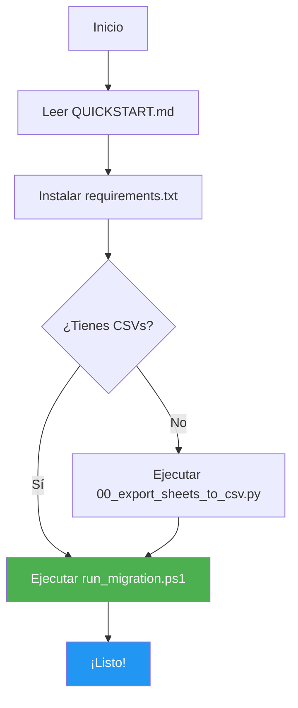

# 📋 ÍNDICE DE ARCHIVOS DE MIGRACIÓN

## 📁 Estructura Completa

```
migration/
├── 00_export_sheets_to_csv.py      # 📥 Exportador de Google Sheets
├── 01_create_schema.sql            # 🗄️  Schema MySQL (3NF)
├── 02_etl_migration.py             # 🔄 Script ETL principal
├── 03_pre_migration_validator.py   # ✅ Validador de pre-requisitos
├── 04_post_migration_verification.py # 🔍 Verificador post-migración
├── 99_rollback.sql                 # ↩️  Script de rollback
├── queries_ejemplos.sql            # 📚 Queries SQL de ejemplo
├── requirements.txt                # 📦 Dependencias Python
├── run_migration.ps1               # 🚀 Script automatizado (Windows)
├── .env.example                    # 🔐 Template de configuración
├── README.md                       # 📖 Documentación completa
└── QUICKSTART.md                   # ⚡ Guía de inicio rápido
```

---

## 🎯 Uso de Cada Archivo

### 🔧 Scripts de Ejecución

| Archivo | Cuándo Usarlo | Descripción |
|---------|---------------|-------------|
| `run_migration.ps1` | **RECOMENDADO** | Script todo-en-uno que ejecuta todo el proceso automáticamente |
| `03_pre_migration_validator.py` | Antes de migrar | Valida que todo esté listo |
| `02_etl_migration.py` | Durante migración | Script ETL principal (Python) |
| `04_post_migration_verification.py` | Después de migrar | Verifica integridad de datos |

### 📄 Scripts SQL

| Archivo | Cuándo Usarlo | Descripción |
|---------|---------------|-------------|
| `01_create_schema.sql` | Primera vez | Crea todas las tablas e inserta datos seed |
| `99_rollback.sql` | Si falla migración | Revierte cambios y limpia datos |
| `queries_ejemplos.sql` | Después de migrar | Queries de ejemplo para operar el sistema |

### 🔧 Herramientas

| Archivo | Cuándo Usarlo | Descripción |
|---------|---------------|-------------|
| `00_export_sheets_to_csv.py` | Opcional | Si necesitas exportar desde Google Sheets |
| `requirements.txt` | Al inicio | Instala dependencias: `pip install -r requirements.txt` |
| `.env.example` | Al inicio | Copia a `.env` y configura credenciales |

### 📚 Documentación

| Archivo | Para Qué |
|---------|----------|
| `README.md` | Guía completa paso a paso |
| `QUICKSTART.md` | Comandos rápidos para empezar |

---

## 🚀 Flujo Recomendado



### O Manualmente:

1. `python 03_pre_migration_validator.py` - Validar
2. `mysql < 01_create_schema.sql` - Crear schema
3. `python 02_etl_migration.py` - Migrar
4. `python 04_post_migration_verification.py` - Verificar

---

## 🆘 Troubleshooting

| Problema | Solución | Archivo a Revisar |
|----------|----------|-------------------|
| Error de conexión MySQL | Verifica credenciales | `.env` |
| Falta un CSV | Exporta manualmente o usa script | `00_export_sheets_to_csv.py` |
| Datos inconsistentes | Ejecuta verificador | `04_post_migration_verification.py` |
| Migración fallida | Haz rollback | `99_rollback.sql` |
| Errores en logs | Revisa | `migration.log` |

---

## 📊 Checklist de Archivos

**Antes de empezar, verifica que tengas:**

- [ ] `requirements.txt` → Instalado (`pip install -r ...`)
- [ ] `.env` → Configurado (copia de `.env.example`)
- [ ] `csv_exports/` → Con archivos CSV
- [ ] MySQL → Instalado y corriendo

**Después de migrar, revisa:**

- [ ] `migration.log` → Sin errores críticos  
- [ ] `backup_*.sql` → Backup creado
- [ ] MySQL → Datos verificados

---

## 💡 Tips

- **Primera vez**: Usa `run_migration.ps1` (automático)
- **Producción**: Ejecuta scripts manualmente uno por uno
- **Testing**: Usa `99_rollback.sql` para limpiar y reintentar
- **Queries**: Revisa `queries_ejemplos.sql` para aprender el nuevo schema

---

¿Dudas? Lee `README.md` completo 📖
